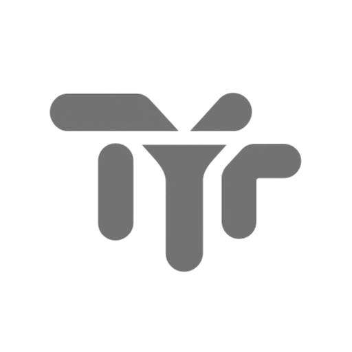

<p align="center">
  
</p>

<h1 align="center">TyfTrack</h1>

<p align="center">
  <b>Floating time tracker for macOS, wired straight into Bexio.</b><br>
  Multiple parallel timers · liquid-glass UI · one click books the hours in your Swiss accounting.
</p>

<p align="center">
  
  
  
  
</p>

---

**TyfTrack** is a native macOS menu-bar app for freelancers and small teams who bill their time through **[Bexio](https://www.bexio.com)**, the Swiss business software. A small always-on-top glass panel floats over your work: start a stopwatch per client and project, run several at once, pause, and when the job is done, one click books the timesheet into Bexio — nothing is ever sent before you decide to.

## Why it exists

Bexio's web timesheet is fine for typing hours after the fact — TyfTrack is for capturing them **while you work**, without a browser tab, with the honesty features a real workday needs:

- ⏱ **Multiple simultaneous timers** — one per client/project, visible and ticking.
- 🛰 **Direct Bexio integration** — timesheets (`POST /2.0/timesheet`) with client, project, business activity, note, billable flag and status (*Done* by default). Contacts, projects and activities are cached locally with instant search; projects auto-filter by client.
- 😴 **Presence-aware** — going to sleep or locking the screen pauses the timers; after N idle minutes the idle time is **deducted automatically**. No inflated hours.
- 🔁 **Continue a sent entry** — resume one of your last bookings the same day: the Bexio entry flips to *In progress* and the next send **updates it** instead of creating a duplicate.
- ⚡ **Quick timer** — start now, assign the client later. Also scriptable via `tyftrack://` URLs (Shortcuts / Siri).
- 🧊 **Liquid-glass design** — translucent panel in the spirit of macOS 26, TYF flavored.
- 🔐 **Keychain-stored API token**, rounding rules (1/5/6/15 min), launch at login, English/French/German following your macOS language.

Full manual: **[HELP.md](HELP.md)**.

## Install

### Download

Grab `TyfTrack.zip` from the [latest release](https://github.com/ThankYouFuture/TyfTrack/releases), unzip, move `TyfTrack.app` to `/Applications`. The build is not notarized (no Apple Developer account), so on first launch either right-click → *Open*, or run:

```bash
xattr -d com.apple.quarantine /Applications/TyfTrack.app
```

### Build from source

No Xcode needed — the Apple Command Line Tools are enough:

```bash
git clone https://github.com/ThankYouFuture/TyfTrack.git
cd TyfTrack
./Scripts/build.sh install   # builds, copies to /Applications, launches
```

### Connect Bexio

Create a personal token on [developer.bexio.com](https://developer.bexio.com) → *API Tokens*, then in TyfTrack: **⚙︎ Settings → paste → Test & save**. Done — your clients, projects and activities sync locally.

## Architecture

```
Sources/
├── main.swift            AppKit entry point
├── AppDelegate.swift     Floating NSPanel, menu bar, tyftrack:// URL scheme
├── Models.swift          Timer engine: sleep/lock/idle watchers, persistence
├── BexioAPI.swift        REST client for api.bexio.com + local cache
├── L10n.swift            EN / FR / DE strings (follows the OS language)
├── Keychain.swift        Token storage
├── Settings.swift        Preferences
└── *View*.swift          SwiftUI, custom liquid-glass styling
```

Plain `swiftc` build, hand-rolled `.app` bundle, ad-hoc signature — see [Scripts/build.sh](Scripts/build.sh).

## Keywords

*Bexio time tracking, Bexio timesheet, macOS app, menu bar timer, Swiss accounting, Zeiterfassung, saisie des heures, SwiftUI, floating timer.*

---

<p align="center">
  Built with ⏱ by <a href="https://tyf.ch"><b>TYF</b></a> — Thank You Future Sàrl, Switzerland
</p>
